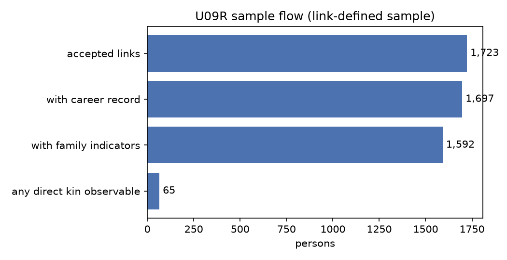
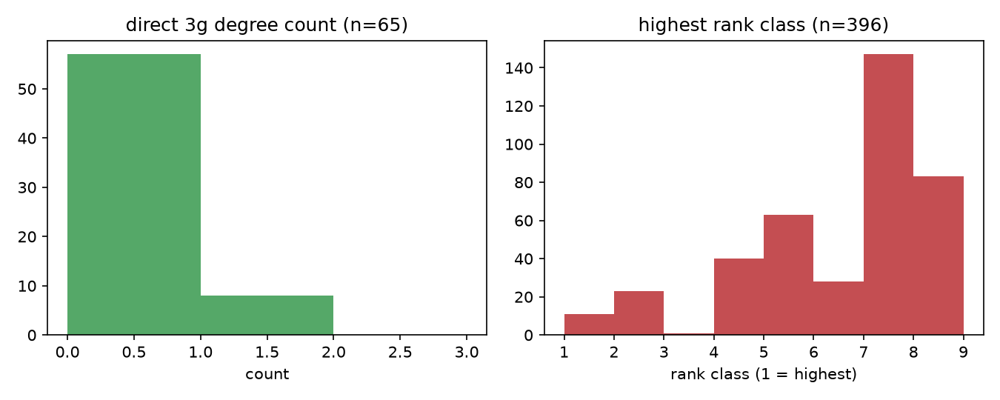
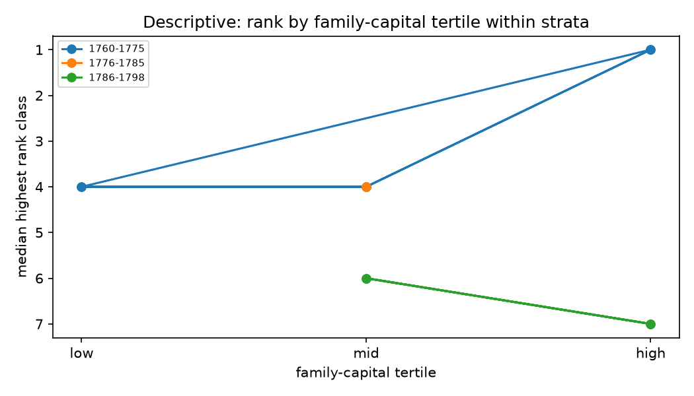

# U09R — 家庭资本与职业轨迹（描述性关联）

- 阶段：V0.3 U09R（第一次正式 substantive analysis）；生成时间 2026-09-27T15:23:41+00:00
- 本阶段**不做因果识别**：所有数字都是 association / selection / composition 层面的描述
- 所有数字由 artifact 渲染（`data/processed_v03/analysis_*.parquet`、`data/interim_v03/analysis/u09r_metrics.json`）

## 1. 样本流图

- 已接受链接：1,723
- 其中在 U08R 职业面板中有任职记录：1,697
- 其中有 CBDB 家世指标：1,592
- 去重后分析样本：1,204 人
- **直系亲属可观测（exposure 有定义）**：65 人（0.054）

**样本由链接定义**：只有 CGED-Q 名册记录与 CBDB 记录被接受为同一人的人才会进入。因此链接成功率本身就是选择机制，不是噪声；下表按链接置信度拆开。

## 2. source / kin observability 与 linkage quality

| group | n | share | family_observable | family_observable_share | rank_known | route_known |
| --- | --- | --- | --- | --- | --- | --- |
| all linked persons | 1204 | 1.0 | 65 | 0.054 | 396 | 692 |
| link_confidence=u06r_auto_accept | 305 | 0.2533 | 0 | 0.0 | 109 | 172 |
| link_confidence=v02_deterministic | 899 | 0.7467 | 65 | 0.0723 | 287 | 520 |
| cohort_id=1760-1775 | 677 | 0.5623 | 38 | 0.0561 | 225 | 411 |
| cohort_id=1776-1785 | 93 | 0.0772 | 2 | 0.0215 | 41 | 65 |
| cohort_id=1786-1798 | 434 | 0.3605 | 25 | 0.0576 | 130 | 216 |

| dimension | value | n | family_observable_share | median_direct_degree_count | median_highest_rank |
| --- | --- | --- | --- | --- | --- |
| link_confidence | u06r_auto_accept | 305 | 0.0 | nan | 7.0 |
| link_confidence | v02_deterministic | 899 | 0.0723 | 0.0 | 7.0 |

## 3. family-capital 分布（仅在亲属可观测的人中）

| exposure | denominator | n_observed | mean | share_gt0 | p25 | median | p75 |
| --- | --- | --- | --- | --- | --- | --- | --- |
| direct_3g_degree_count | 65 | 65 | 0.123 | 0.1231 | 0.0 | 0.0 | 0.0 |
| direct_3g_office_count | 65 | 65 | 0.0 | 0.0 | 0.0 | 0.0 | 0.0 |
| direct_elite_generations | 65 | 65 | 0.123 | 0.1231 | 0.0 | 0.0 | 0.0 |
| all_senior_elite_kin_count | 65 | 65 | 0.0 | 0.0 | 0.0 | 0.0 | 0.0 |

## 4. career-outcome 分布（全样本）

| outcome | denominator | n_observed | summary |
| --- | --- | --- | --- |
| highest_rank_class | 1204 | 396 | median 7.0 |
| highest_admin_level | 1204 | 1204 | unknown=512; county=356; central=234; prefectural=91; provincial=11 |
| central_local_route | 1204 | 1204 | unknown=512; local_only=436; central_only=213; mixed=43 |
| n_events | 1204 | 1204 | 1=325; 2=229; 3=221; 4=127; 5=96; 6=85; 7=43; 8=21 |

## 5. 分层描述（cohort / credential / region）

| cohort_id | exposure_tertile | size | median | mean | exposure | outcome |
| --- | --- | --- | --- | --- | --- | --- |
| 1760-1775 | low | 6 | 4.0 | 4.0 | direct_3g_degree_count | highest_rank_class |
| 1760-1775 | mid | 3 | 4.0 | 4.333333333333333 | direct_3g_degree_count | highest_rank_class |
| 1760-1775 | high | 3 | 1.0 | 3.0 | direct_3g_degree_count | highest_rank_class |
| 1776-1785 | mid | 1 | 4.0 | 4.0 | direct_3g_degree_count | highest_rank_class |
| 1786-1798 | mid | 1 | 6.0 | 6.0 | direct_3g_degree_count | highest_rank_class |
| 1786-1798 | high | 3 | 7.0 | 7.666666666666667 | direct_3g_degree_count | highest_rank_class |
| 1760-1775 | low | 6 | 4.0 | 4.0 | direct_elite_generations | highest_rank_class |
| 1760-1775 | mid | 3 | 4.0 | 4.333333333333333 | direct_elite_generations | highest_rank_class |
| 1760-1775 | high | 3 | 1.0 | 3.0 | direct_elite_generations | highest_rank_class |
| 1776-1785 | mid | 1 | 4.0 | 4.0 | direct_elite_generations | highest_rank_class |
| 1786-1798 | mid | 1 | 6.0 | 6.0 | direct_elite_generations | highest_rank_class |
| 1786-1798 | high | 3 | 7.0 | 7.666666666666667 | direct_elite_generations | highest_rank_class |

## 6. 预注册模型：数据门槛判定

- 决定：**descriptive_only**
- 双侧可观测行数：17（总计 1,204）
- 缺失率：0.9859
- 触发原因：rows with both sides observed 17 < 200; missingness 0.99 > 0.5; small cells — cohort_id: 1760-1775=12, 1776-1785=1, 1786-1798=4; 9 of 9 exposure×outcome cells hold fewer than 5 observations

**没有任何模型被报告**：门槛不满足时，按预注册规则降级为描述性结果，不允许用惩罚模型或先验把不可识别的量包装成估计。

## 7. 敏感性

| variant | n | n_family_observable | n_both_observed | median_highest_rank | corr_degrees_rank | interpretable | note |
| --- | --- | --- | --- | --- | --- | --- | --- |
| all_links | 1204 | 65 | 17 | 5.0 | nan | False | n below the model floor — direction only, no inference |
| u06r_auto_accept_only | 305 | 0 | 0 | nan | nan | False | n below the model floor — direction only, no inference |
| v02_deterministic_only | 899 | 65 | 17 | 5.0 | nan | False | n below the model floor — direction only, no inference |
| direct_line_only | 1204 | 65 | 17 | 5.0 | nan | False | n below the model floor — direction only, no inference |
| direct_plus_extended | 1 | 1 | 1 | 4.0 | nan | False | n below the model floor — direction only, no inference |
| complete_direct_line | 13 | 13 | 3 | 4.0 | nan | False | n below the model floor — direction only, no inference |

## 8. Historiographical Claim Delta

| claim | decision | evidence | note |
| --- | --- | --- | --- |
| VC-1 三代直系足以刻画家族资本 | CONFIRM | 直系三代齐全 13 人；可观测直系亲属者仅 65 人 | 与 U04R 的 REVISED 一致：三代不完整，必须报告可观测性 |
| VC-2 家世差异可用汇总比例表达 | NOT_COMPARABLE | 本阶段样本由链接定义，无法代表总体 | 链接成功是选择机制；只作描述 |
| VC-3 科举是主要资格渠道（需保留捐纳/生员） | REFINE | credential 分层见 §5；样本内 jinshi/juren/gongsheng/shengyuan/jianshi 分布已并列 | 与 LIT-0011/LIT-0016 的 QUALIFIED 一致 |
| VC-4 功名越低新进者越多 | NEW | 样本内可观测者过少，无法检验该单调性 | 登记为未检验，不是被推翻 |
| VC-5 旗籍只作分层变量 | REFINE | 见 §2 分层覆盖；旗籍在链接样本中记录不全 | 与 LIT-0018 一致：制度差异可能改变机制 |

## 9. 边界与限制

- exposure 只在亲属可观测时定义；不可观测者进入覆盖表、不进入关联行，**never counted as 0**。
- 官品表（`office_ranks.yaml`）是策展表且 `verification_status=pending`，任何以 `rank_class` 为基础的陈述都继承了这一未核验状态。
- 跨来源冲突检测在 U09R 未重跑（事件 person 键仍为来源原生 id），冲突数不进入本报告。
- 链接成功是选择机制：`u06r_auto_accept` 与 `v02_deterministic` 两组的覆盖与中位数已在 §2 并列。
