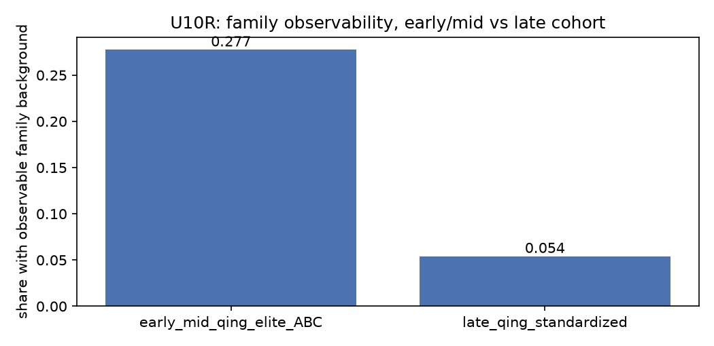
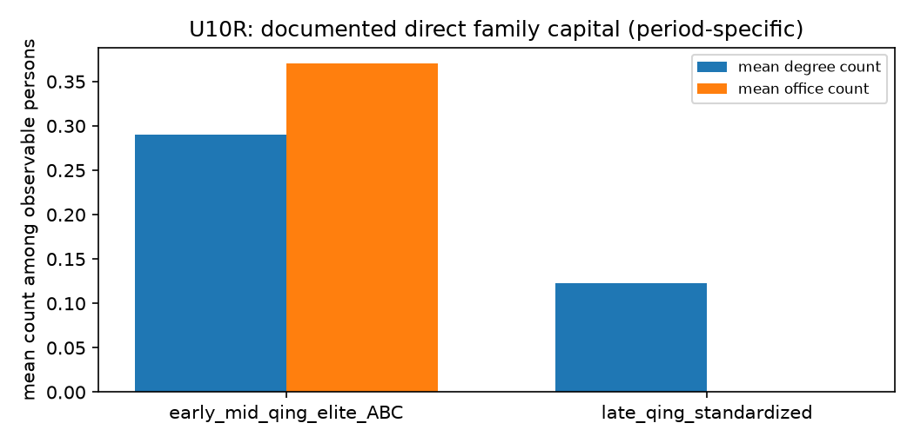

# U10R — early/mid-Qing elite extension（A/B/C 作为扩展，不主导设计）

- 阶段：V0.3 U10R；生成时间 2026-09-27T17:25:14+00:00
- 所有数字由 artifact 渲染；本阶段**不做 pooled regression**

## 1. 复用而非重采

- v0.1 冻结产物从 git 历史恢复：`person_indicators` / `family_final` / `officials_master`（39,988 / 119,964 / 39,988 行）
- 未重新运行 v0.1 流水线、未新增采集

## 2. 变量映射（旧 → V0.3）

| legacy_variable | v03_variable | status | note |
| --- | --- | --- | --- |
| n_slots_degree | direct_3g_degree_count | comparable_with_caveat | v0.1 counts slots holding a degree record among the three direct slots; the V0.3 count is the same shape but the slot definitions come from the CBDB kin map |
| n_slots_office | direct_3g_office_count | comparable_with_caveat | same as n_slots_degree |
| elite_generations_count | direct_elite_generations | comparable_with_caveat | both count generations with a degree or an office; v0.1 treats an unrecorded slot as a non-elite generation, V0.3 excludes it from the denominator |
| ancestor_official_any | documented_direct_office_any | comparable_after_recomputation | v0.1 coded 0 when records were simply absent (U00-01); the extension frame recomputes the flag only where a slot is documented |
| banner_effective | banner_status | comparable_with_caveat | unknown stays unknown and is never read as non-banner |
| native_province | native_province | comparable_with_caveat | CBDB address folding differs from the JSL 籍貫 field used by the late-Qing cohort |
| strict_commoner_3g | — | not_comparable | v0.1 derived it from absence of record; V0.3 forbids turning missing evidence into a negative fact |
| ancestor_high_official | — | not_comparable | built on the v0.2 tier ladder; tier is a legacy/extension outcome in V0.3, not an exposure |
| ancestor_high_official_sensitivity | — | not_comparable | same tier dependence as ancestor_high_official |
| ancestor_office_tiers | — | not_comparable | raw tier strings, not a family-capital count |
| n_slots_sufficient | — | not_comparable | a count of documented slots, not of capital; comparable only as coverage |
| highest_tier | — | not_comparable | the legacy outcome itself |

## 3. 扩展样本

- A/B/C 人数：1,179（tier 分布 {'B': 613, 'C': 450, 'A1': 92, 'A3': 15, 'A2': 9}）
- 其中家世可观测：327（0.2774）
- D 层：**未纳入**（D is not revived as a family-capital control: its family material is effectively absent (U09R coverage) and the stage prompt forbids it）

## 4. 比较（逐项分类）

### documentation_share

| cohort | n | family_observable | share | family_source | classification | note |
| --- | --- | --- | --- | --- | --- | --- |
| early_mid_qing_elite_ABC | 1179 | 327 | 0.2774 | v0.1 CBDB kin + 清史稿 window | CROSS_PERIOD_CONSISTENT | both periods document family background for a minority; the levels differ by source protocol and population, so only the direction is comparable |
| late_qing_standardized | 1204 | 65 | 0.054 | link-defined CBDB entries for a JSL career sample | CROSS_PERIOD_CONSISTENT | both periods document family background for a minority; the levels differ by source protocol and population, so only the direction is comparable |

### direct_capital

| cohort | denominator_observable | mean_degree_count | mean_office_count | share_any_degree | share_any_office | classification | note |
| --- | --- | --- | --- | --- | --- | --- | --- |
| early_mid_qing_elite_ABC | 327 | 0.2905 | 0.37 | 0.2508 | 0.3211 | PERIOD_SPECIFIC | slot definitions come from two different pipelines (v0.1 slot build vs CBDB kin map); levels are not directly comparable |
| late_qing_standardized | 65 | 0.1231 | 0.0 | 0.1231 | 0.0 | PERIOD_SPECIFIC | slot definitions come from two different pipelines (v0.1 slot build vs CBDB kin map); levels are not directly comparable |

### regional_composition

| cohort | province | share | classification | note |
| --- | --- | --- | --- | --- |
| early_mid_qing_elite_ABC | unknown | 0.4623 | PERIOD_SPECIFIC | province folding differs between the CBDB address tree and the JSL 籍貫 field |
| early_mid_qing_elite_ABC | 江蘇 | 0.1111 | PERIOD_SPECIFIC | province folding differs between the CBDB address tree and the JSL 籍貫 field |
| early_mid_qing_elite_ABC | 浙江 | 0.0908 | PERIOD_SPECIFIC | province folding differs between the CBDB address tree and the JSL 籍貫 field |
| early_mid_qing_elite_ABC | 山東 | 0.045 | PERIOD_SPECIFIC | province folding differs between the CBDB address tree and the JSL 籍貫 field |
| early_mid_qing_elite_ABC | 安徽 | 0.0441 | PERIOD_SPECIFIC | province folding differs between the CBDB address tree and the JSL 籍貫 field |
| early_mid_qing_elite_ABC | 直隸 | 0.0399 | PERIOD_SPECIFIC | province folding differs between the CBDB address tree and the JSL 籍貫 field |
| early_mid_qing_elite_ABC | 湖北 | 0.0314 | PERIOD_SPECIFIC | province folding differs between the CBDB address tree and the JSL 籍貫 field |
| early_mid_qing_elite_ABC | 江西 | 0.0246 | PERIOD_SPECIFIC | province folding differs between the CBDB address tree and the JSL 籍貫 field |

### banner_status

| cohort | banner_status | n | share | classification | note |
| --- | --- | --- | --- | --- | --- |
| early_mid_qing_elite_ABC | unknown | 787 | 0.6675 | NOT_COMPARABLE | the late-Qing cohort records banner status for very few persons; unknown is never read as non-banner |
| early_mid_qing_elite_ABC | manchu_banner | 273 | 0.2316 | NOT_COMPARABLE | the late-Qing cohort records banner status for very few persons; unknown is never read as non-banner |
| early_mid_qing_elite_ABC | han_bannerman | 75 | 0.0636 | NOT_COMPARABLE | the late-Qing cohort records banner status for very few persons; unknown is never read as non-banner |
| early_mid_qing_elite_ABC | mongol_banner | 29 | 0.0246 | NOT_COMPARABLE | the late-Qing cohort records banner status for very few persons; unknown is never read as non-banner |
| early_mid_qing_elite_ABC | bannerman_ethnicity_unknown | 6 | 0.0051 | NOT_COMPARABLE | the late-Qing cohort records banner status for very few persons; unknown is never read as non-banner |
| early_mid_qing_elite_ABC | booi_bannerman | 6 | 0.0051 | NOT_COMPARABLE | the late-Qing cohort records banner status for very few persons; unknown is never read as non-banner |
| early_mid_qing_elite_ABC | banner_unspecified | 3 | 0.0025 | NOT_COMPARABLE | the late-Qing cohort records banner status for very few persons; unknown is never read as non-banner |

### elite_persistence

| cohort | measure | denominator | share | classification | note |
| --- | --- | --- | --- | --- | --- |
| early_mid_qing_elite_ABC | share with a high-office ancestor (legacy definition) | 327 | 0.1376 | NOT_COMPARABLE | built on the v0.2 tier ladder, which V0.3 demotes to a legacy outcome |
| late_qing_standardized | share with any elite senior collateral kin | 65 | 0.0 | NOT_COMPARABLE | the early cohort has no collateral measure at all; v0.1 only recorded three direct slots |

### career_outcomes

| cohort | outcome | value | n | share | classification | note |
| --- | --- | --- | --- | --- | --- | --- |
| early_mid_qing_elite_ABC | legacy tier (extension outcome only) | B | 613 | 0.5199 | PERIOD_SPECIFIC | tier is a v0.1 construct; V0.3 keeps it as legacy/extension only |
| early_mid_qing_elite_ABC | legacy tier (extension outcome only) | C | 450 | 0.3817 | PERIOD_SPECIFIC | tier is a v0.1 construct; V0.3 keeps it as legacy/extension only |
| early_mid_qing_elite_ABC | legacy tier (extension outcome only) | A1 | 92 | 0.078 | PERIOD_SPECIFIC | tier is a v0.1 construct; V0.3 keeps it as legacy/extension only |
| early_mid_qing_elite_ABC | legacy tier (extension outcome only) | A3 | 15 | 0.0127 | PERIOD_SPECIFIC | tier is a v0.1 construct; V0.3 keeps it as legacy/extension only |
| early_mid_qing_elite_ABC | legacy tier (extension outcome only) | A2 | 9 | 0.0076 | PERIOD_SPECIFIC | tier is a v0.1 construct; V0.3 keeps it as legacy/extension only |
| late_qing_standardized | central/local route (V0.3) | unknown | 512 | 0.4252 | NOT_COMPARABLE | the early cohort has no route variable; comparing route shares with a tier census would compare constructs, not periods |
| late_qing_standardized | central/local route (V0.3) | local_only | 436 | 0.3621 | NOT_COMPARABLE | the early cohort has no route variable; comparing route shares with a tier census would compare constructs, not periods |
| late_qing_standardized | central/local route (V0.3) | central_only | 213 | 0.1769 | NOT_COMPARABLE | the early cohort has no route variable; comparing route shares with a tier census would compare constructs, not periods |
| late_qing_standardized | central/local route (V0.3) | mixed | 43 | 0.0357 | NOT_COMPARABLE | the early cohort has no route variable; comparing route shares with a tier census would compare constructs, not periods |

## 5. 结论分类汇总

| classification | rows |
| --- | --- |
| PERIOD_SPECIFIC | 15 |
| NOT_COMPARABLE | 13 |
| CROSS_PERIOD_CONSISTENT | 2 |

**pooled regression**：未运行。原因：cohorts differ in sampling design (elite census vs link-defined roster sample) and in variable definitions; pooling would estimate the design difference

## 6. 限制

- 两个 cohort 的抽样设计不同（精英普查 vs 链接定义的样本），任何时期差异都混入了设计差异。
- v0.1 的槽位定义与 V0.3 的 CBDB 亲属映射来自两条不同管线；计数可比、水平不可比。
- banner 在晚期 cohort 中记录极少；`unknown` 从不读作非旗人。
- 官品表仍 `verification_status=pending`；本阶段未使用 `rank_class` 做任何跨期比较。
